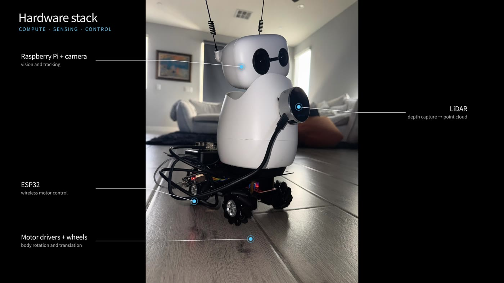
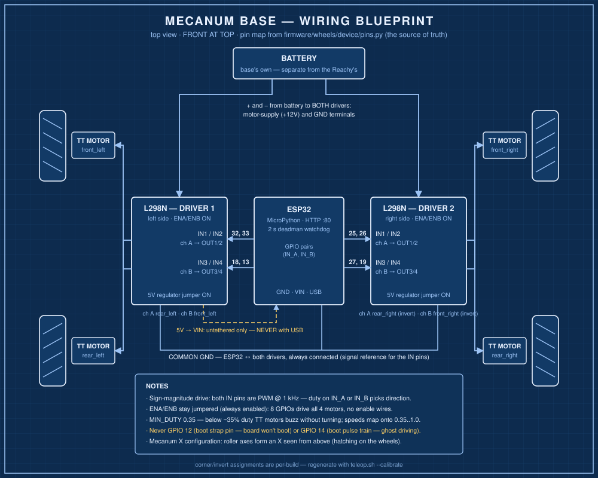
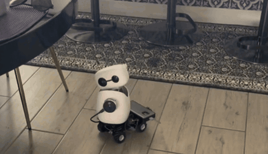
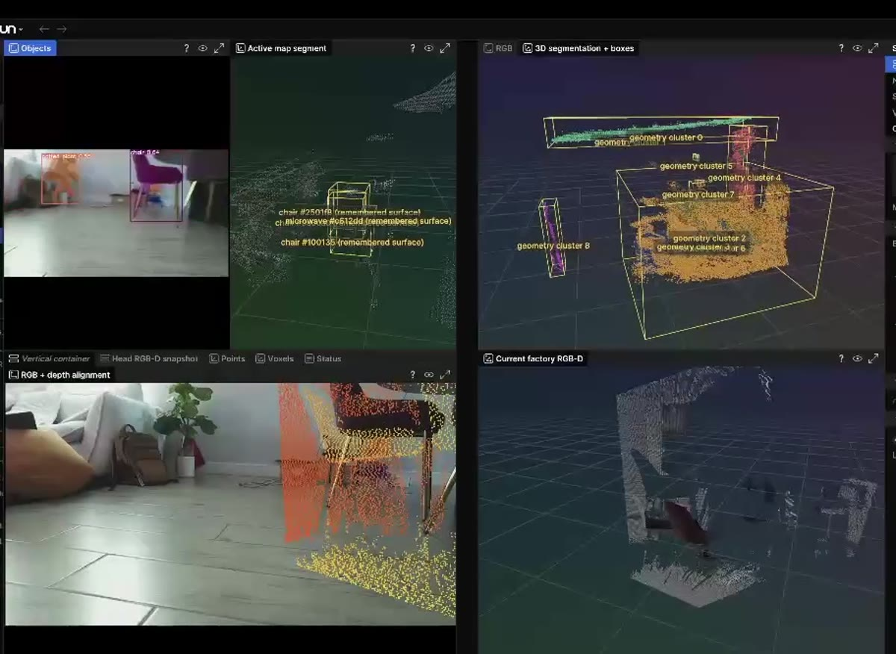
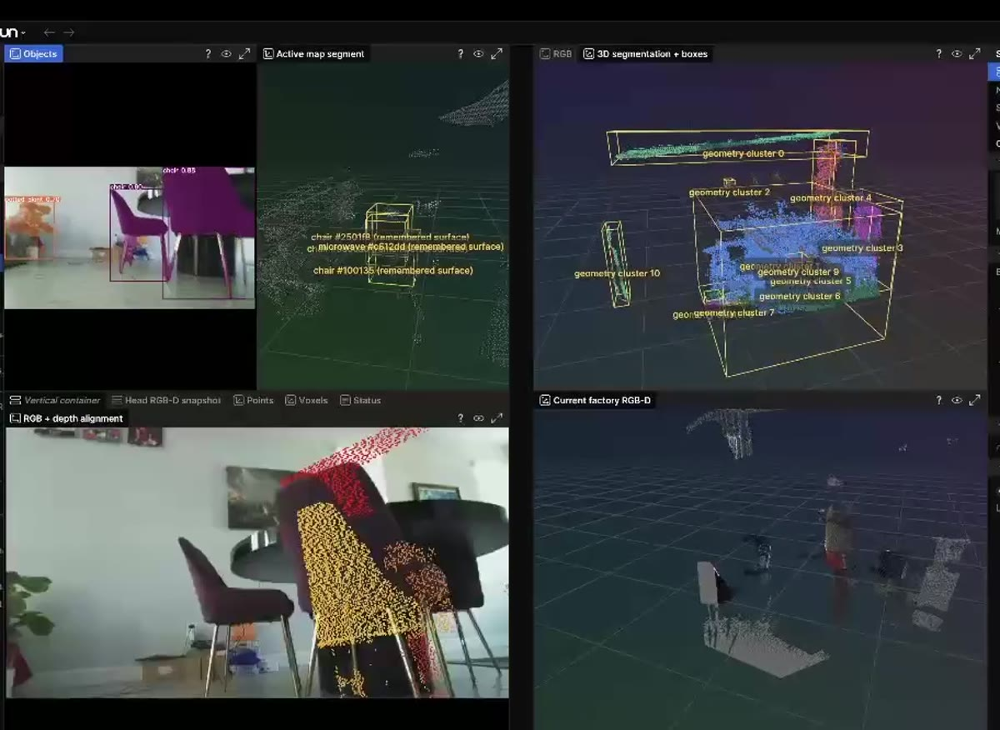
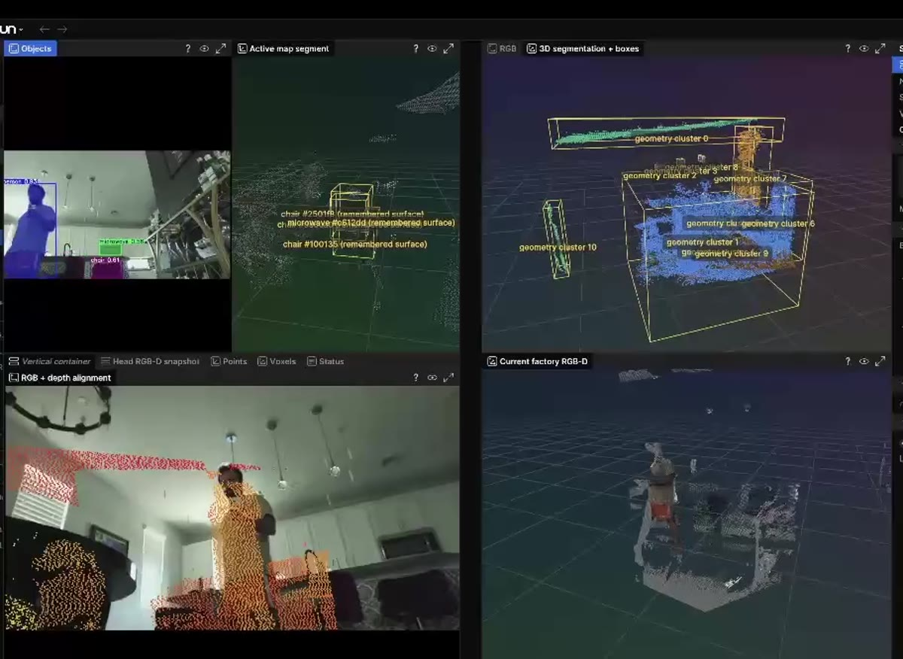

# Reachy × dimOS Blueprint

**Build a mobile robot with spatial memory from off-the-shelf parts, powered by
[dimOS](https://github.com/dimensionalOS/dimos).**

A stock [Reachy Mini](https://github.com/pollen-robotics/reachy_mini) has one
mono RGB camera and no way to move. This repository is the complete,
reproducible record of how we turned one into a robot that drives around a
home, remembers where things are, and takes spoken commands — using only
off-the-shelf parts and the glue code in this repo, with dimOS doing the heavy
lifting.

## The whole story in 40 seconds

[](docs/media/reachy-r3-stack.mp4)

**[▶ Watch the walkthrough](docs/media/reachy-r3-stack.mp4)** — the startup
scan, the hardware stack, and the closed *sense → track → move* loop running
live. (GitHub serves repo-hosted video as a download, so it opens in a new tab.)

## Build it

<p align="center">
  <a href="docs/diagrams/wiring-blueprint.svg"></a>
  <a href="docs/media/reachy-r3-stack.mp4"></a>
  <br>
  <sub>The base's wiring blueprint (click to enlarge) and the finished robot driving itself between table legs.</sub>
</p>

| | Parts |
| --- | --- |
| **Robot** | Reachy Mini |
| **Base** | LewanSoul mecanum chassis kit (frame, 4 TT motors, 66 mm wheels) · ESP32 · 2× L298N · 2S 7.4 V LiPo |
| **Depth** | Intel RealSense L515 (discontinued — buy used) · Raspberry Pi 3B+ |
| **Station** | Any Mac or Linux box that runs DepthPro — we used an Apple-silicon Mac and an NVIDIA DGX Spark |

- **[Bill of materials](hardware/BOM.md)** — every part, with purchase links.
- **[Assembly guide](hardware/ASSEMBLY.md)** — bench the base alone, mount the
  Reachy, add the depth sensor, calibrate, then drive and scan. Safety notes
  included.

## What we built, in order

1. **Assembled a Reachy Mini.** Out of the box it can look around and that's
   it: one mono RGB camera in the head, no depth, no wheels.
2. **Gave the mono camera 3D perception.** A companion machine — the
   *station*, a Mac or a DGX Spark — estimates metric depth from the live
   head-camera stream with **DepthPro** or the **Depth-Anything-3** family,
   and pairs each frame with the head's kinematic pose. This grew out of our
   workbench experiments with MASt3R; we also ran **LingBot-Map**
   reconstruction on the Spark, which isn't packaged here yet.
3. **Fed it into dimOS.** RGB-D and pose go into dimOS's own pipeline —
   ObjectDB, SpatialMemory — unmodified. dimOS builds a persistent spatial map
   with remembered object surfaces; Rerun shows it live.
4. **Built open-source wheels.** An ESP32, two hobby motor drivers, four
   mecanum wheels and their own battery make a wireless omnidirectional base
   with a small HTTP API and a hardware deadman.
5. **Mounted the Reachy on the base** and taught it to drive: person
   following (detector → tracker → control law → head gaze + wheel motion),
   with voice commands layered on the same loop.
6. **Added true depth.** An Intel RealSense LiDAR camera on the Reachy,
   served by a Raspberry Pi, replaces estimated depth with measured point
   clouds.
7. **Calibrated camera ↔ depth** with classical computer vision (a ChArUco
   board), so LiDAR depth lands in the head camera's frame before it reaches
   dimOS.

The result: a robot built from commodity primitives — an RGB camera, a depth
sensor, a set of wheels — that dimOS turns into spatial memory, perception,
and agentic control.

## dimOS building the map, live

The same Rerun layout at three points in one drive around a room:

| Early in the scan | Clusters forming | Room mostly covered |
| --- | --- | --- |
|  |  |  |

Note the labels that persist across all three frames — `chair (remembered
surface)`, `microwave (remembered surface)`. Those are dimOS SpatialMemory
entries outliving the current view: the robot remembers where things are even
when it's no longer looking at them. Full clip:
[reachy-3d-perception.mp4](docs/media/reachy-3d-perception.mp4).

## It moves

| | |
| --- | --- |
| [**Person following**](docs/media/reachy-person-following.mp4) — ONNX detector → tracker → pure control law → head gaze + continuous mecanum motion | [**Voice-driven navigation**](docs/media/reachy-nav-demo.mp4) — a live conversation steering the three-tier *look / turn / drive* motion hierarchy against a live point cloud |

## Architecture


Two paths share one viewer. The **mono path** needs only the Reachy: depth is
estimated from its head camera. The **RGB-D path** adds the L515 for measured
depth and the planner. Both render in Rerun.

Three wire protocols hold it together: the robot streams **JPEG frames + head
pose over WebSocket**, the Pi serves **binary point clouds over pull-based
HTTP**, and anything that moves the wheels is a **JSON `POST /cmd`** to the
ESP32 — which stops on its own two seconds after the last command, whatever
crashed upstream.

## Quick start

Four ways to run it, from zero hardware to the full build. Environment setup
(the dimOS fork checkout, `DIMOS_DIR`, Python deps) is in
[station/README.md](station/README.md).

**1. Zero hardware — synthetic depth server.** Prove the depth add-on's whole
HTTP + browser path with nothing but numpy:

```bash
pip install numpy
cd perception/depth_server
python -m realsense_viewer.server --synthetic --host 127.0.0.1
# open http://127.0.0.1:8765/ — an animated point cloud in WebGL
```

**2. Offline replay — the dimOS pipeline with no robot.** Feed a recording
(`camera.mp4` + `camera_timestamps.jsonl` + `head_pose.jsonl`) to the station
server as a fake robot. No sample recording ships with the repo (ours are of
a private home); the layout is documented in
[station/README.md](station/README.md#b-offline-replay-no-robot), and any tool
that writes it works:

```bash
python -m station.dimos_bridge.server --dimos-dir "$DIMOS_DIR" \
  --depth depthpro --pose external --extra --viz rerun          # terminal 1
python -m station.dimos_bridge.replay_to_bridge /path/to/recording --host 127.0.0.1
```

**3. Live mono scan — Reachy + station.** Deploy the streamer app, then one
command runs bridge, pipeline and Rerun, and points the robot at your machine:

```bash
./scripts/deploy.sh robot robot/scanner_app reachy-mini.local
DIMOS_DIR=/path/to/dimos ./scripts/scan.sh        # Mac; add --device cuda on NVIDIA
# arrow keys / WASD pan-tilt the head; quit saves a map under ~/.dimos/sessions/
```

> Modes 2 and 3 run the pipeline script from our pinned dimOS fork. Clone it
> **without** `--recurse-submodules` — the `xr_nav` modules it needs are
> vendored in [station/vendor/](station/vendor/README.md). For
> Depth-Anything-3 instead of DepthPro, pass `--depth da3` after installing
> [Depth-Anything-3](https://github.com/DepthAnything/Depth-Anything-3).
> Setup details: [station/README.md](station/README.md#1-which-dimos-the-fork-pinned).

**4. RGB-D mapping + dry-run navigation — full build.** With the depth
add-on attached and calibrated, and the wheels app deployed
(`./scripts/deploy.sh robot robot/wheels_app`):

```bash
export DEPTH_SERVER_URL=http://<pi-ip>:8765 WHEELS_HOST=<wheels-ip>
python -m station.l515.l515_stack --directory ./l515-output
# web UI at http://127.0.0.1:8777/ (embeds the Rerun web viewer, :8778)
```

Navigation plans paths but stays a dry run — see the honest list of what is
and isn't calibrated in
[perception/calibration/README.md](perception/calibration/README.md).

## Repository layout

```
robot/
  scanner_app/     Reachy Mini app: stream head-camera frames + pose to the station
  wheels_app/      Reachy Mini app: drive the base — D-pad, person following, voice
station/
  dimos_bridge/    WebSocket bridge + the dimOS fork pipeline (mono path)
  vendor/          xr_nav mapping modules the fork's pipeline imports (vendored)
  l515/            RGB-D mapping, perception, dry-run navigation (depth path)
  assets/          Pollen Robotics' official Reachy Mini MJCF model
perception/
  depth_server/    Raspberry Pi service: L515 → point clouds over HTTP
  calibration/     ChArUco head-camera intrinsics + camera↔depth extrinsics
firmware/
  wheels/          ESP32 MicroPython firmware for the mecanum base
hardware/          bill of materials + assembly guide
docs/              diagrams and demo media
scripts/           deploy.sh (apps → robot/sim) · scan.sh (one-command mono scan)
```

## Authors

Built by **Alireza Bahremand** and **Don Balanzat**.

## Credits

- [dimOS](https://github.com/dimensionalOS/dimos) — the agentive operating
  system for physical space. This repo exists to show how little you need on
  top of it. The mono pipeline runs via
  [our pinned fork](https://github.com/TheWiselyBearded/dimos) — see
  [station/README.md](station/README.md#1-which-dimos-the-fork-pinned) for
  why the fork, and [station/vendor/](station/vendor/README.md) for the
  mapping modules vendored from it.
- [Reachy Mini](https://github.com/pollen-robotics/reachy_mini) by Pollen
  Robotics.
- [Rerun](https://rerun.io) for visualization.
