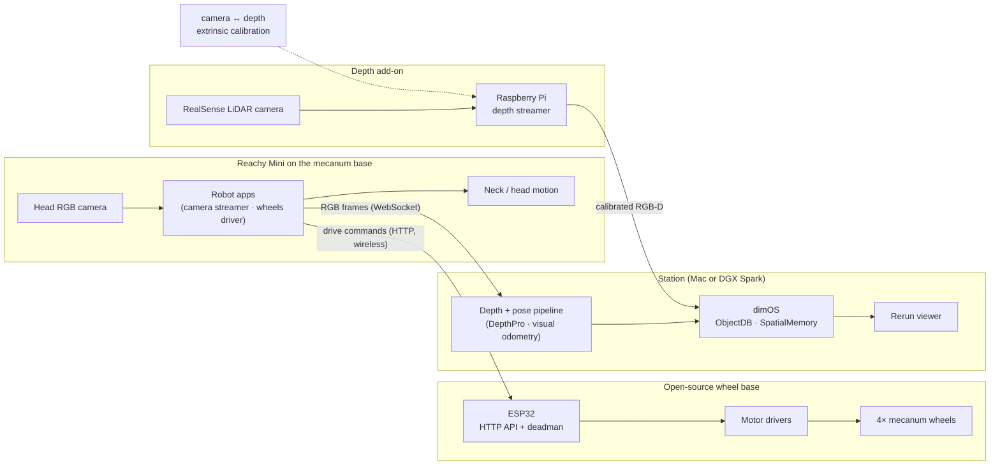

# Reachy × dimOS Blueprint

**Build a mobile robot with spatial memory from off-the-shelf parts, powered by
[dimOS](https://github.com/dimensionalOS/dimos).**

This repository is the complete, reproducible record of how we took a
[Reachy Mini](https://github.com/pollen-robotics/reachy_mini) — a desktop robot
with a single mono RGB camera and no mobility — and turned it into a robot that
drives itself around a home, remembers where objects are, and takes natural-
language commands. Every part is commercial off-the-shelf; every line of glue
code is in this repo.

## The whole story in 40 seconds

[](docs/media/reachy-r3-stack.mp4)

**[▶ Watch the walkthrough](docs/media/reachy-r3-stack.mp4)** — startup scan,
the hardware stack, and the closed *sense → track → move* loop running live.
(GitHub serves repo-hosted video as a download; the clip opens in a new tab.)

## What we built, in order

1. **Bought and assembled a Reachy Mini.** Out of the box it can look around —
   that's it. One mono RGB camera in the head, no depth, no wheels.
2. **Gave the mono camera 3D perception.** A companion machine (a Mac, or an
   NVIDIA DGX Spark — we call it the *station*) runs a depth-estimation and
   pose pipeline on the live head-camera stream: monocular metric depth
   (DepthPro) plus visual odometry, descended from our workbench experiments
   with MASt3R and Depth-Anything-3.
3. **Fed it into dimOS.** The station pipes RGB-D + pose into dimensionalOS's
   own pipeline — ObjectDB, SpatialMemory — unmodified. dimOS gives the robot
   a persistent spatial map with remembered object surfaces; Rerun is the
   viewer. We don't reimplement any of it.
4. **Built open-source wheels.** An ESP32, hobby motor drivers, four mecanum
   wheels and a dedicated battery become a wireless omnidirectional base with
   a tiny HTTP API and a hardware deadman.
5. **Mounted the Reachy on the base** and taught it to drive: person
   following (detector → tracker → control law → head gaze + wheel motion)
   and voice-driven navigation layered on the same loop.
6. **Added true depth.** An Intel RealSense LiDAR depth camera on the Reachy,
   streaming through a Raspberry Pi, replaces estimated depth with measured
   point clouds.
7. **Calibrated camera ↔ depth sensor** with classical computer vision, so
   LiDAR depth projects into the head camera's frame of reference before it
   enters the dimOS pipeline.

The result: a robot assembled from COTS primitives — an RGB camera, a depth
sensor, a set of wheels — that dimOS elevates into spatial memory, perception,
and agentic control.

## dimOS building the map, live

The same Rerun layout at three points in one drive around a room:

| Early in the scan | Clusters forming | Room mostly covered |
| --- | --- | --- |
|  |  |  |

Note the labels that persist across all three frames — `chair (remembered
surface)`, `microwave (remembered surface)`. Those are dimOS SpatialMemory
entries outliving the current view: the robot remembers where things are even
when it's no longer looking at them. Full clip:
[reachy-3d-perception.mp4](docs/media/reachy-3d-perception.mp4).

## It moves

| | |
| --- | --- |
| [**Person following**](docs/media/reachy-person-following.mp4) — ONNX detector → tracker → pure control law → head gaze + continuous mecanum motion | [**Voice-driven navigation**](docs/media/reachy-nav-demo.mp4) — a live conversation steering the three-tier *look / turn / drive* motion hierarchy against a live point cloud |

## Architecture



## Repository layout

```
hardware/    bill of materials, assembly guide, wiring
firmware/    ESP32 MicroPython firmware for the mecanum base
robot/       apps that run on the Reachy Mini (camera streamer, wheels driver)
perception/  Raspberry Pi depth streamer + camera↔depth calibration
station/     Mac/DGX-side bridge that feeds live frames into dimOS
docs/        the story, diagrams, and demo media
scripts/     one-command deploy and run helpers
```

## Quick start

> Section finalized after hardware docs land — see [hardware/BOM.md](hardware/BOM.md)
> for the parts list and [hardware/ASSEMBLY.md](hardware/ASSEMBLY.md) for the build.

## Credits

- [dimOS](https://github.com/dimensionalOS/dimos) — the agentive operating
  system for physical space. This repo exists to show how little you need on
  top of it.
- [Reachy Mini](https://github.com/pollen-robotics/reachy_mini) by Pollen
  Robotics.
- [Rerun](https://rerun.io) for visualization.
