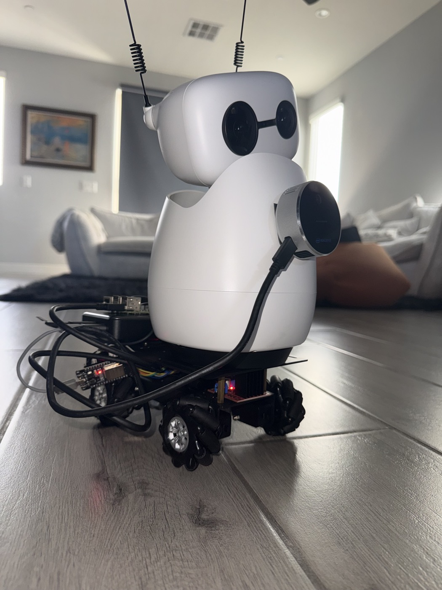

# Assembly guide

How the robot goes together, in the order that actually works: bench the
wheel base alone, then put the Reachy on it, then add depth, then calibrate,
then drive. Every step below ends with something you can test before moving
on. Parts are in the [bill of materials](BOM.md).



> **Read the safety notes first.** This is a top-heavy robot on a narrow
> omnidirectional base. The safety callouts in each step are not decoration —
> every one of them corresponds to something that went wrong at least once.

## 1. Bench the wheel base

Build and prove the base **before** the Reachy ever touches it. It is its own
self-contained robot: chassis, four TT gearmotors with mecanum wheels, two
L298N driver boards, an ESP32, and a dedicated battery.
[firmware/wheels/README.md](../firmware/wheels/README.md) is the full
reference for everything in this step; this section is the ordered walk
through it.

### 1a. Mechanics

Mount the four TT gearmotors to the chassis plate and fit the mecanum wheels
in the standard **X configuration**: viewed from above, the rollers form an X.
You need 2 left-hand and 2 right-hand wheels — if strafing later pushes the
chassis diagonally instead of sideways, two wheels are swapped.

### 1b. Wiring


One L298N per side, two motors each. Each motor is one L298N channel, driven
sign-magnitude on its two `IN` pins — so `ENA`/`ENB` jumpers stay **on** and
8 GPIOs drive all 4 motors. PWM runs at 1 kHz, and commanded speeds are mapped
onto the duty band `MIN_DUTY..1.0` (`MIN_DUTY = 0.35`) because TT motors just
buzz below ~35% duty.

The pin map, reproduced from the firmware README (`device/pins.py` is the
single source of truth — edit that file, not this table, when you move a wire):

| Channel name | L298N inputs | GPIO (IN_A, IN_B) | Corner in shipped map | invert |
| --- | --- | --- | --- | --- |
| `DRIVER1_A` | driver 1, IN1 / IN2 | 32, 33 | `rear_left` | False |
| `DRIVER1_B` | driver 1, IN3 / IN4 | 18, 13 | `front_left` | False |
| `DRIVER2_A` | driver 2, IN1 / IN2 | 25, 26 | `rear_right` | True |
| `DRIVER2_B` | driver 2, IN3 / IN4 | 27, 19 | `front_right` | True |

The *corner* and *invert* columns depend on how **you** wired it — the guided
calibration in step 1e regenerates them for your build; don't trust the
shipped values.

**Do not use GPIO 12 or GPIO 14** for motor inputs: GPIO12 is a strapping pin
(a driver holding it high at reset stops the ESP32 booting at all), and
GPIO14 emits a pulse train during boot that shows up as wheels "ghost
driving". The map above already avoids both.

Power:

- Battery → both L298N motor-supply (`+12V`) terminals and `GND`; leave the
  L298N 5 V regulator jumper **on**.
- **ESP32 `GND` ↔ driver `GND` always connected** — it is the signal
  reference for the IN pins.
- On the bench with USB attached: power the ESP32 from USB and leave the
  driver's `+5V` → ESP32 `VIN` wire **disconnected**.
- Untethered: connect `+5V` → `VIN` and unplug USB. **Never both at once.**

### 1c. Flash and deploy the firmware

The firmware targets MicroPython 1.29.x, `ESP32_GENERIC` build. From
`firmware/wheels/`:

```bash
pip install esptool mpremote
PORT=/dev/cu.usbserial-XXXX   # ls /dev/cu.usbserial-* (macOS) or /dev/ttyUSB* (Linux)
esptool --port $PORT erase-flash
esptool --port $PORT --baud 460800 write-flash -z 0x1000 ESP32_GENERIC-<version>.bin

cp device/netcfg.example.py device/netcfg.py
$EDITOR device/netcfg.py      # WiFi mode + credentials, API token
./deploy.sh                   # push device/ over USB serial
```

`netcfg.py` holds your WiFi password and is git-ignored; the deploy scripts
refuse to run until it exists. Start in `"ap"` mode (the board hosts its own
network — nothing else required), switch to `"sta"` once you want robot, base
and station on one LAN. The ESP32 is 2.4 GHz only.

> **Safety: pin lockdown at boot.** `boot.py` drives all 8 motor inputs LOW
> before anything else runs, so a floating H-bridge input can't twitch the
> wheels at power-up. If you change the pin map, change it in `pins.py` so
> the lockdown list stays correct.

### 1d. Selftest

Prop the chassis up so the wheels spin free, then on the REPL
(`mpremote connect $PORT repl`):

```python
>>> import selftest
>>> selftest.run()          # each wheel forward then reverse, one at a time
>>> selftest.primitives()   # on the floor: every primitive once
>>> selftest.demo()         # on the floor: rotate, translate, announced
```

### 1e. Calibrate the wheel map and drive it

```bash
./teleop.sh --calibrate     # guided: which corner did each channel spin?
./teleop.sh                 # keyboard driving + per-wheel keys
./teleop.sh --host <board-ip>   # same over WiFi, no cable
```

The calibration spins each L298N channel, asks which corner moved and which
way the **top of the wheel** travelled, then rewrites the `WHEELS` block in
`pins.py` and offers to deploy it.

**Strafe is the test that matters**: forward, reverse and rotation all look
right even with front/rear corners swapped — only strafing exposes the swap
(details in the
[firmware README](../firmware/wheels/README.md#bench-bring-up)). Judge by
chassis motion, not by watching the wheels: a correctly driven mecanum wheel
often *looks* like it is turning backwards.

> **Safety: the deadman.** Every `/cmd` the board receives arms a 2 s
> deadline; if no follow-up command arrives, the wheels coast to a stop. A
> crashed controller, dropped WiFi or pulled cable can never leave the base
> driving. Continuous control means re-sending faster than the timeout —
> all the clients in this repo already do.

## 2. Mount the Reachy on the plate

Bolt the Reachy Mini to the chassis plate. Two things to get right:

- **Power stays separate.** The Reachy keeps its own battery; the base has
  its own. The robot and the wheels meet only mechanically (the plate) and
  over WiFi — there is no wire between them.
- **Note which way it faces.** If the Reachy is not bolted facing
  chassis-forward, record the offset: the wheels app's `track_mount_yaw_deg`
  setting (see [robot/wheels_app/README.md](../robot/wheels_app/README.md))
  rotates every drive command so "forward" always means the *robot's*
  forward. Our build faces the chassis's right (`-90`).

> **Safety: it is now top-heavy.** The assembled robot is tall on a narrow
> wheelbase. Accelerate gently (translations at speed 0.4–0.6), never chain
> sudden direction reversals, and expect rotate-in-place to be the shakiest
> primitive under load.

## 3. Attach the L515 and the Raspberry Pi

Mount the Intel RealSense L515 on the Reachy's torso, facing forward, and
connect it to the Raspberry Pi with a **USB 3** cable into a USB 3 port (the
blue ones on a Pi 4/5). The Pi rides on the base and serves depth over HTTP.

Software on the Pi is its own saga — librealsense **must be pinned to
v2.48.0** for the L515, built with the RSUSB backend and Python bindings.
Follow [perception/depth_server/README.md](../perception/depth_server/README.md)
end to end: the source build, udev rules, the systemd service, and a
`--synthetic` mode that lets you prove the whole HTTP + browser path before
the camera is even attached. When it's up:

```bash
curl -s http://<pi-ip>:8765/healthz     # {"ok": true, "state": "streaming"}
# and open http://<pi-ip>:8765/ for the WebGL point-cloud viewer
```

## 4. Calibrate camera ↔ depth

The L515 and the head camera see the world from different places; the
calibration solves the transform between them so measured depth can be
projected into the head camera's frame. Full procedure:
[perception/calibration/README.md](../perception/calibration/README.md).
In outline:

1. Show a ChArUco board (5×7 squares, `DICT_5X5_100` — a tablet screen or a
   print whose square size you've measured) to the head camera from ~13
   varied positions (`capture_rgb_view.py`).
2. Fit the head camera's intrinsics (`fit_rgb.py`, then
   `make_intrinsics_candidate.py`).
3. With the head **held still**, capture ~6 stationary paired views seen by
   both cameras at once (`capture_calibration_pair.py`, with the depth
   server running in `--color` mode).
4. Fit the extrinsics (`fit_pair.py`) — it writes
   `paired-extrinsics-report.json`, which the station's L515 stack consumes.
5. Sanity-check the report's held-out errors (ours: sub-pixel) before using it.

Being honest about scope: this calibrates **two cameras at one head pose**.
There is no wheel-base (`base_link`) calibration in this repo — nothing
measures where the cameras sit relative to the chassis — which is exactly why
the navigation stack stays in dry-run mode (step 5c). The subtlety of carrying
the calibration across head *motion* (two different head→camera values, and
when each applies) is documented in
[station/l515/ARTICULATED_RGBD.md](../station/l515/ARTICULATED_RGBD.md).

## 5. First drive, first scan

### 5a. First drive (wheels app)

Deploy the wheels app to the Reachy and drive from a browser:

```bash
./scripts/deploy.sh robot robot/wheels_app reachy-mini.local
# then open http://<robot>:8042 and set the chassis host (the ESP32's IP)
```

You get a touch D-pad, keyboard driving, live per-wheel telemetry, and —
after the one-time detector + FOV setup in
[robot/wheels_app/README.md](../robot/wheels_app/README.md) — person
following and Gemini-voice driving.

> **Safety, before any autonomous motion:**
> - The head camera is **blind within ~20 cm of the wheels** — it sits high
>   and cannot see the floor right around the base.
> - **Treat every surface edge as a cliff.** On a table or countertop, stop
>   a full body-length from any edge and never drive toward one.
> - **Never test follow mode near stairs or drop-offs.** Follow drives the
>   base continuously toward a moving person; a person can walk somewhere
>   the robot must not go.

### 5b. First scan (mono path)

With the scanner app deployed (`./scripts/deploy.sh robot robot/scanner_app`)
and a station set up per [station/README.md](../station/README.md):

```bash
DIMOS_DIR=/path/to/dimos ./scripts/scan.sh          # Mac; --device cuda for NVIDIA
```

Arrow keys pan/tilt the head from the station terminal, dimOS builds the map,
Rerun opens by itself. **Caveat:** this path currently depends on the dimOS
fork's private `xr-nav` submodule, so third parties can't run it yet — the
details are in [station/README.md](../station/README.md). The L515 path below
does not have this problem.

### 5c. RGB-D mapping and (dry-run) navigation

```bash
export DEPTH_SERVER_URL=http://<pi-ip>:8765 WHEELS_HOST=<wheels-ip>
python -m station.l515.l515_stack --directory ./l515-output
```

This supervises continuous mapping, perception and a local web UI at
`http://127.0.0.1:8777/` (Rerun web viewer on `:8778`), using your calibration
report from step 4. Navigation plans paths but stays a **dry run** — without
the base calibration that doesn't exist yet, no mapped-geometry path is
qualified to command the wheels, and every wheel-moving script requires an
explicit `--execute`.
