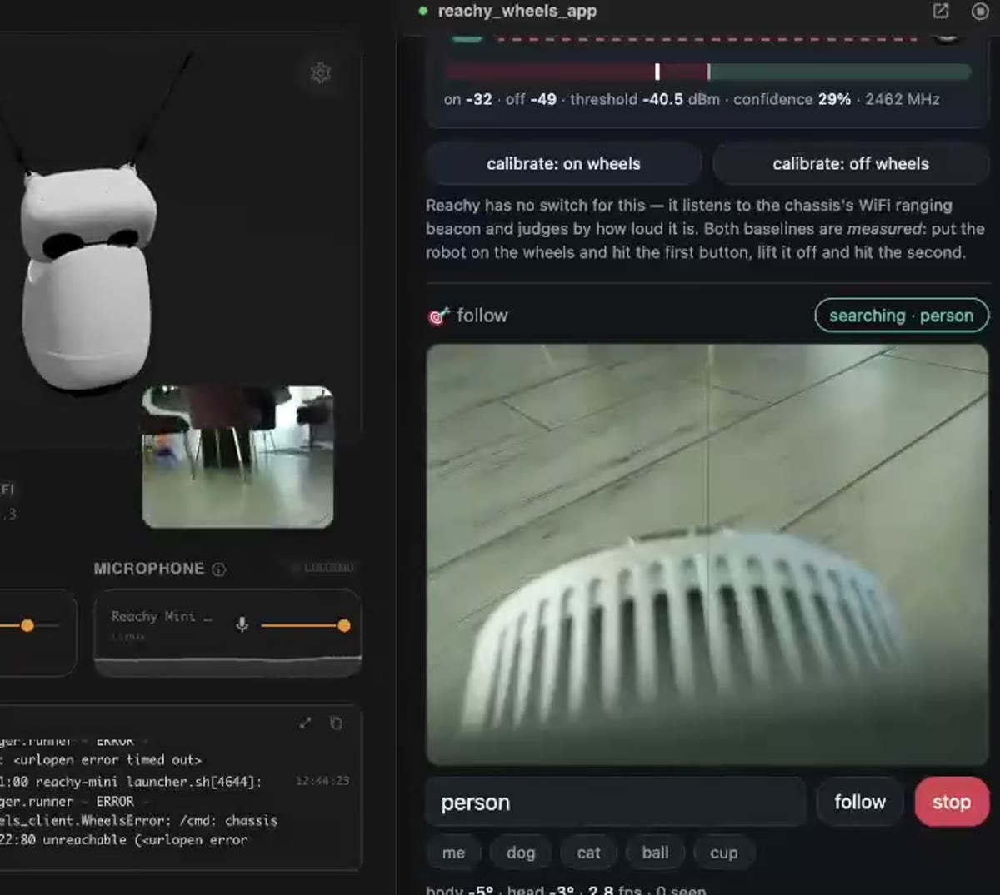

# reachy_wheels_app

Reachy Mini app that drives the **Wheels** mecanum chassis — the
ESP32/MicroPython base in [`../../firmware/wheels/`](../../firmware/wheels/)
that exposes movement primitives over a LAN HTTP API (port 80 on the ESP32's
LAN IP; see [Configuration](#configuration)).


[](../../docs/media/reachy-person-following.mp4)

Two clips of this app on the real robot: [person following](../../docs/media/reachy-person-following.mp4) — detector → tracker → head gaze + continuous base motion — and [voice-driven navigation](../../docs/media/reachy-nav-demo.mp4), where a Gemini Live conversation drives the look / turn_body / drive hierarchy.

Reachy Mini has no wheels of its own; this app is the bridge that lets the
Reachy ecosystem tap into that hardware. Three ways to drive:

**Voice (Gemini Live audio+video)** — built on proven Reachy Mini Gemini
Live plumbing. Talk to Reachy ("what's around you?", "look
left", "come here", "follow me", "stop"); Gemini hears through the robot
mic, sees through the head camera, answers through the speaker, and moves
on a **three-tier hierarchy**, smallest tier first:

1. `look` — head yaw/pitch: glance at and scan things while conversing
2. `turn_body` — rotate the body shell to face beyond head range
3. `drive` — the wheels: approach, follow, or rotate past the shell limit

Escalation is mechanical: when a tier hits its limit, the tool reply tells
the model which tier to use next (and is scheduled so the model hears it).
All tools are NON_BLOCKING — Gemini speaks while motions run. Voice drives
are clamped to `max_drive_seconds` (default 4 s) per command on top of the
board deadman.
The Gemini key is set in the UI's voice panel (`POST /api/voice/config`) and
stored only in the app's config file on the robot; the app never reads it
from anywhere else and never echoes it back.

**Follow (visual tracking)** — point Reachy at a person or object and it
keeps facing and approaching it by itself, continuously, until told to stop.
Say “follow me” / “follow the dog”, tap a chip in the **🎯 follow** panel at
`http://<robot>:8042`, or `POST /api/track/start {"target": "person"}`.

The loop is: head camera → detector → Roboflow [`trackers`][trk] (SORT) for
stable ids → a pure control law → motion. It locks onto *one* track id, so
someone walking through frame can't steal the robot.

Motion uses the same three tiers as the voice agent, in the same order:

1. **head** gazes at the target — fast, quiet, and what makes the robot look
   attentive;
2. **body shell** takes over once the head is carrying more than
   `track_body_assist_deg` (12°) of the offset, so the robot turns to *face*
   what it is following instead of watching it out of the corner of its eye;
3. **wheels** rotate and drive, to close distance and to reach past where
   the shell can twist.

It holds station about **2 m** back (`track_follow_distance_m`).

Losing the target goes hold → **search** → stop. Search is ordered rather
than blended, and ends up looking **right around the robot**:

| phase | covers | |
| --- | --- | --- |
| head scan | up 20°, down 25°, left/right 40° | wheels and shell remain stopped |
| shell viewpoint | 60° toward the last sighting, then repeat the head scan | bounded by the ±120° cable limit |
| wheel sectors | 45°, then stop and repeat the head scan | only after both upper tiers completed |

Stopping between wheel sectors gives the detector sharp frames instead of
continuous rotational blur. The wheels remain the only tier that can expose
the blind wedge behind the robot. `search_covered_deg` in
`/api/track/status` reports how much azimuth has been swept. The whole
search runs for `track_search_seconds` (default **60 s**, adjustable) before
it gives up and stops.

[trk]: https://trackers.roboflow.com/latest/

**Manual** — a touch-friendly D-pad UI at `http://<robot>:8042`:

- 3×3 pad: forward / reverse / strafe left–right / four mecanum diagonals
- rotate CW / CCW, big STOP, speed slider
- hold-to-drive (pointer or W/A/S/D · Q/E · arrows · space = stop)
- live telemetry: per-wheel speeds, last command, deadman countdown
- chassis host configurable from the page, persisted in
  `~/.config/reachy_wheels_app/state.json`

## Configuration

Settings live in `~/.config/reachy_wheels_app/state.json` on the robot and
are edited from the web UI at `http://<robot>:8042`. Nothing network-specific
is baked in — on first launch, set:

| setting | where | example |
| --- | --- | --- |
| chassis host | UI → *chassis settings*, or env `WHEELS_HOST` (+ `WHEELS_PORT`, default 80) | `192.0.2.10` (your ESP32's LAN IP) |
| Pi depth service | UI → *DimOS sensors*, or env `DEPTH_SERVER_URL` | `http://<pi-ip>:8765` |
| Gemini API key | UI → voice panel | — |
| remote detector (optional) | UI → *chassis settings* | `http://<station-ip>:8055/detect` |

The environment variables are only first-run defaults (handy for local runs
and tests); once a value is saved from the UI, the saved value wins. Until a
chassis host is set, drive commands fail fast with a message saying so, and
the UI stays up.

## Setting up following

Two pieces, both one-time:

**1. A detector.** The default backend runs on the robot over COCO's 80
classes (person, dog, cat, bottle, cup, chair, sports ball, backpack, …).
It needs an ONNX model file — nothing here vendors weights:

```bash
pip install ultralytics
yolo export model=yolo11n.pt format=onnx imgsz=320
scp yolo11n.onnx pollen@<robot>:~/.config/reachy_wheels_app/models/
```

For **anything you can name** ("the red mug"), run an open-vocabulary
detection service on your station that speaks the small HTTP contract
documented at the top of `reachy_wheels_app/tracking/detect_remote.py`
(Roboflow-inference-shaped replies are accepted too), then set the follow
detector to *remote* with its URL under chassis settings.

**2. Calibrate the camera field of view.**

`track_hfov_deg`/`track_vfov_deg` are the only numbers turning pixels into
angles, so a robot that over- or under-turns while following almost always
has these wrong. Set them with
`POST /api/track/config {"track_hfov_deg": …, "track_vfov_deg": …}`.

The method that works: turn the head a few degrees and match ORB features of
the *static scene* between frames (1000+ correspondences), reading the head's
**actual** angle back from the daemon so a neck that under-travels cannot
bias it. People wandering through are a minority of features and the median
ignores them.

Measured on our robot: **69.1° H / 42.3° V** (focal ≈ 929 px at 1280×720) —
a good starting point for a stock Reachy Mini head camera.

> Do not calibrate against a detected *person*. A human cannot hold still
> enough, their bounding box wanders with posture, and — worst — a slow
> steady drift produces a *perfect* straight-line fit at the wrong angle.
> Repeated attempts that way gave 74°, 90° and 122°. R² cannot see this;
> only a two-pass sweep (to cancel drift) or the feature method can.

**3. Set the mounting offset** if the robot is not bolted onto the chassis
facing the way the chassis drives. `track_mount_yaw_deg` is the angle from
chassis-forward to robot-facing, CCW: `-90` means the robot faces the
chassis's right, so "go where I am looking" leaves the board as a
`strafe_right`. This is applied to voice `drive` calls too, so "forward"
always means the robot's forward. Our build uses `-90` (the default).

**4. Roboflow trackers (recommended, optional).**

```bash
ROBOT=reachy-mini.local   # stock hostname, or the robot's IP
ssh pollen@$ROBOT \
  '/venvs/apps_venv/bin/pip install "trackers>=2.0" "supervision>=0.26"'
```

Deliberately **not** a base dependency: it requires `numpy>=2` and the apps
venv is shared with every other installed app, several of which pin
numpy 1.x. Without it the app uses a greedy-IoU fallback tracker with the
same interface — following still works, just less robustly through
occlusion — and the follow panel names whichever backend is live.

Tuning knobs (chassis settings, or `POST /api/track/config`):
`track_follow_distance_m` (default 2.0) is how far behind the target to hold
station — metres, because a frame *fraction* means whatever the lens says
(on the measured 42° vertical FOV the old 0.55 fraction worked out to four
metres, and the robot read as retreating). `track_imgsz` only applies to
dynamic-shape models: a fixed-shape export such as the `imgsz=320` one above
always runs at its baked size, and the app logs when the two disagree.

`GET /api/track/probe?target=person` answers "why isn't it following
anything?" — it runs the follow loop's own detector on the current frame and
reports the frame stats, everything seen, and what matched.

### Known robot quirks found while bringing this up

- **The neck is asymmetric.** Commanding +15° lands at +14.7°; commanding
  −15° lands at −8.9°. No single scalar models that, so
  `MotionLimits.yaw_command_gain` defaults to **1.0** (off) — over-driving
  the side that already tracks would make the loop overshoot, and the loop
  re-measures every frame anyway, so an under-travelling neck costs
  convergence speed, not stability.
- **The voice agent moves the head too.** A live Gemini session will call
  `look`/`follow` on its own initiative, which silently wrecks any
  measurement that assumes the head only moves when you tell it to. Set
  `voice_enabled: false` and restart before calibrating.

## Am I on the wheels?

Reachy has no switch telling it whether it is bolted to the chassis, so the
app listens to the chassis's WiFi ranging beacon and judges by how loud it
is, measured in-process on the robot with `iw scan`. The 🔗 **mount** panel shows the state, the live
signal against the threshold, and a confidence figure.

Both baselines are **measured, not modelled**: put the robot on the wheels
and press *calibrate: on wheels*, lift it off and press *calibrate: off
wheels*. A fitted path-loss model looked tempting and does not work here —
the controlled trial's exponent came out at n=1.15, far outside the
plausible 2.0–3.5, and antenna orientation shifts RSSI as much as a metre of
distance does, so re-seating the robot moves the curve underneath you. Two
learned baselines survive all of that.

Measured on this robot bolted on: **−38 dBm**, and it is a very steady
signal (sd < 0.5 dB over 15 scans).

Two traps this handles, both of which bit during bring-up: the beacon's
**channel moves** when the router reassigns it (it went 6 → 11 mid-session,
and a channel-limited scan pointed at a stale number looks exactly like the
beacon being gone, so the board is asked), and `iw scan` returns the
driver's whole **BSS table including cached entries** — anything older than
2.5 s is dropped, so a stale strong reading can never stand in for a genuine
miss.

`GET /api/mount/status` has the numbers; `POST /api/mount/calibrate`
`{"state": "on"|"off"}` records a baseline.

## Wheel lab (manual per-wheel driving)

Rotating in place is what mecanum wheels are worst at — every roller is
dragged sideways at once, so the lightest-loaded corner slips first and the
pivot walks instead of spinning. `move(vx, vy, omega)` cannot express a fix,
because it normalises the four wheels into one symmetric mix.

The **🔧 wheel lab** panel drives the corners by hand: a slider per wheel
(off/forward/reverse, −1…+1), a speed and a pulse length, HOLD (repeats
until released) and PULSE (one timed burst), a mirror button, and presets
that isolate the interesting hypotheses — one diagonal only, front pair
only, rear pair only, rear-biased, tank-style one side. Each preset says
what its result would mean.

Under it, **per-wheel trim and polarity** go straight to the live board
(`POST /tune`). The board forgets these on reset, so the app remembers what
it pushed and can re-apply them; the panel also prints the `pins.py` block
to paste into the firmware ([`../../firmware/wheels/`](../../firmware/wheels/))
once a set is worth keeping.

```
POST /api/wheels/mix   {"speeds": {"front_left": 1.0, "rear_right": -0.6},
                        "speed": 0.8, "duration": 1.0}
POST /api/wheels/tune  {"wheel": "rear_left", "trim": 0.9}
POST /api/wheels/tune/apply          # re-push after the board reset
GET  /api/wheels/lab                 # presets, trims, last mix
```

A mix is **not** renormalised: what you dial is what the motors get, scaled
by `speed` only. Bear in mind the board rescales magnitude onto
`pins.MIN_DUTY`..1, so 0.1 is not a tenth of the torque of 1.0 — below the
dead zone a TT motor only buzzes.

This needs chassis firmware with the `wheels` command (the firmware in this
repo has it); against older firmware the lab's mix requests fail while
everything else keeps working.

## Safety model

Every command the chassis receives arms a **deadman timer** (2 s unless an
explicit `duration` is sent). The UI re-sends the held command every 300 ms
and sends `/stop` on release; if the app, browser, or wifi dies mid-drive,
the board stops itself. The app also sends a best-effort `/stop` on shutdown.

A follow session obeys the same invariant: every command it emits carries a
short `duration`, so a stalled or crashed loop cannot leave the base
rolling. **Stop means stop everything** — the STOP button, the space bar,
`/api/stop` and the voice `stop` tool all cancel an active follow, because
halting the chassis alone would last exactly one tick of a loop that
re-commands it eight times a second.

Hard-won notes about the mounted robot (also baked into the voice agent's
system prompt):

- **It is top-heavy on a narrow wheelbase.** Accelerate gently: translations
  at speed 0.4–0.6; only rotation needs 0.7+. Never chain sudden direction
  reversals.
- **The camera is blind within ~20 cm of the wheels.** It sits high and
  cannot see the ground right around the base.
- **Treat every surface edge as a cliff.** On a table or countertop, stop a
  full body-length before any visible edge, never drive toward one, and keep
  reverses to a few centimetres.

## Layout

- `reachy_wheels_app/wheels_client.py` — the chassis HTTP client
  (stdlib-only, so it can be copied verbatim into other tools that drive the
  base).
- `reachy_wheels_app/sensors.py` — read-only adapter for the Pi depth
  streamer ([`../../perception/depth_server/`](../../perception/depth_server/)).
- `reachy_wheels_app/api.py` — FastAPI surface (`/api/*`), importable without
  the `reachy_mini` SDK so it is testable offline.
- `reachy_wheels_app/main.py` — the `ReachyMiniApp`; only module that touches
  the SDK.
- `reachy_wheels_app/voice/` — Gemini Live stack: `tools.py` (declarations +
  dispatcher + clamps, pure/testable), `board.py` (transcript ring),
  `gemini_live.py` + `io_harness.py` (session + mic/speaker/camera pumps;
  google-genai imported lazily).
- `reachy_wheels_app/tracking/` — visual following, layered so the
  interesting part needs no robot: `types.py`/`vocab.py` (plain data, phrase
  → detector labels), `detectors.py` + `detect_onnx.py`/`detect_remote.py`
  (backends), `tracker.py` (Roboflow trackers, with the fallback),
  **`follow.py` (the control law — pure: no clock, no IO, no threads)**,
  `session.py` (threads, actuation, status board, lifecycle).
- `reachy_wheels_app/wheel_lab.py` — per-wheel mixes, rotation presets and
  the `pins.py` snippet; pure data + clamps, no IO.
- `reachy_wheels_app/static/` — the D-pad UI (served by the SDK at `/`).

## Deploy / test

From the root of this repository:

```bash
# reachy-mini.local is the stock hostname; pass the robot's IP if mDNS is flaky
./scripts/deploy.sh robot robot/wheels_app reachy-mini.local
PYTHONPATH=robot/wheels_app \
  python -m pytest robot/wheels_app/tests -q
```

Then open `http://<robot>:8042` and set the chassis host (see
[Configuration](#configuration)).

346 tests, fully offline: no SDK, no chassis, no camera, no downloaded
model, no internet. The ONNX detector is exercised end to end against a
synthetically built ONNX graph, the remote one against a real local socket,
and `trackers` is used when installed with the fallback when it is not —
so both tracker paths stay honest.

`pip install onnx` (build-time only, not a runtime dep) enables the
synthetic-model test; it skips cleanly without it.

## DimOS + RealSense sensors (0.9.0)

The **DimOS sensors** panel configures the Raspberry Pi's L515 depth service
from [`../../perception/depth_server/`](../../perception/depth_server/)
(`http://<pi-ip>:8765`; or set `DEPTH_SERVER_URL`), shows depth health, and
links to both camera views.
`/api/sensors/depth` exposes validated, fresh XYZ packets; `/api/camera` provides
Reachy RGB with explicit optical-frame and receiver-time metadata.

The station side ([`../../station/`](../../station/)) consumes these feeds
and hands them to dimOS. DimOS velocity inputs remain dry-run here;
calibrated autonomous base navigation additionally needs base localization,
sensor extrinsics and metric wheel calibration (the blockers
`/api/sensors/status` reports).

The two cameras are separate, unsynchronized views. Existing manual and follow
controls retain their original behavior and do not gain LiDAR avoidance merely
by enabling the sensor feed. Use the wheels app as the sole Reachy camera owner;
the scanner app ([`../scanner_app/`](../scanner_app/), `dimos_scanner`) also
uses port 8042, so run one or the other.
